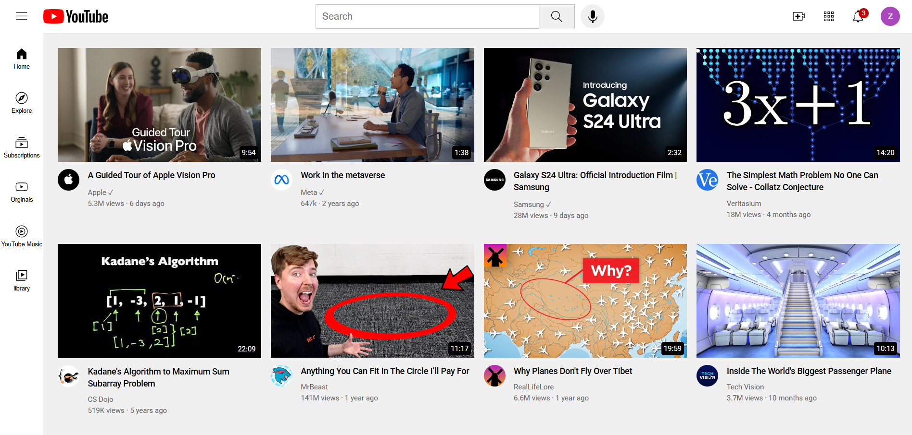

# 📺 YouTube Clone (HTML & CSS)

A static clone of YouTube’s homepage created using **HTML** and **CSS**. This beginner-friendly project helps new developers understand layout structuring, flexbox usage, and clean UI replication.

> ⚠️ **Note:** This project does not include JavaScript functionality and is not fully responsive.

## 🚀 Live Demo

👉 [Live App](https://youtube-clone-html-css-rho.vercel.app/)

## 🛠️ Tech Stack

- **HTML5**
- **CSS3**

## ✨ Features

- YouTube-inspired interface
- Flexbox-based layout system
- Custom styled navigation bar and video grid
- Good practice for UI cloning

## 📚 Ideal For

- HTML & CSS beginners
- Layout and UI practice
- Static website cloning
- CSS styling techniques

## 📫 Contact Me

- **📧 Email:** muhdzaheermv@gmail.com  
- **🔗 Portfolio:** [https://portfolio-lilac-eight-60.vercel.app/](https://portfolio-lilac-eight-60.vercel.app/)  
- **💼 LinkedIn:** [https://www.linkedin.com/in/muhammed-zaheer-836132244/](https://www.linkedin.com/in/muhammed-zaheer-836132244/)

## ⭐ Like This Project?

If you found this project helpful or liked the design, please consider giving it a **⭐ star** on GitHub — your support is appreciated!

